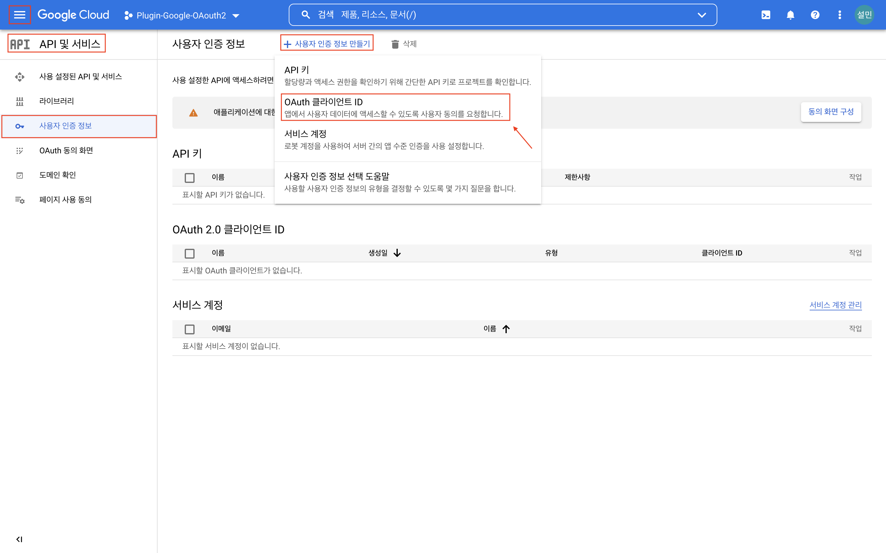
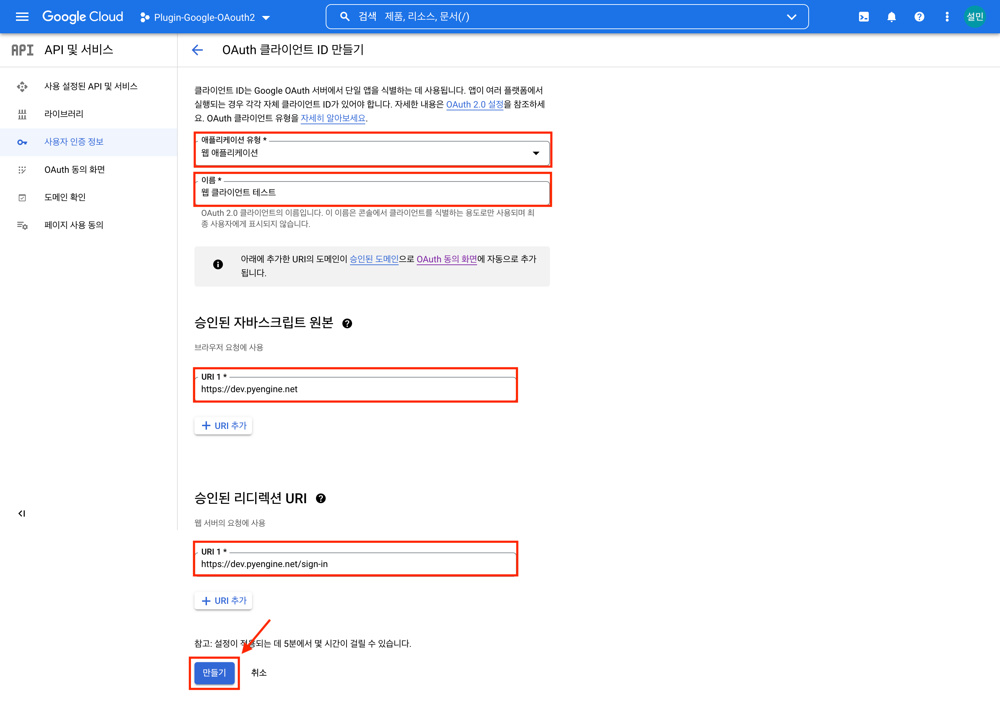
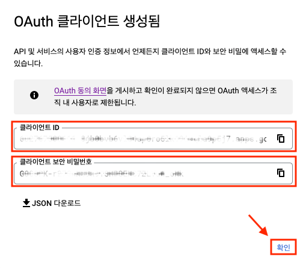
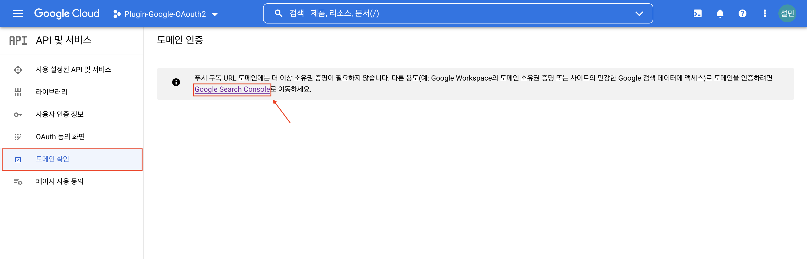
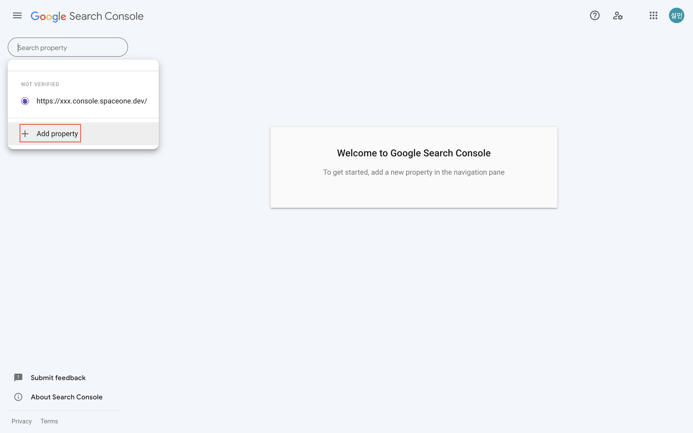
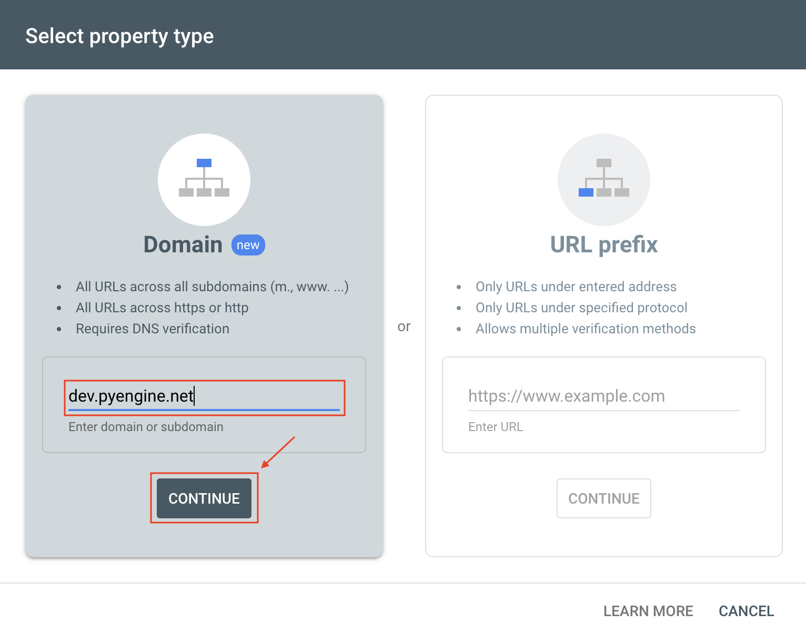
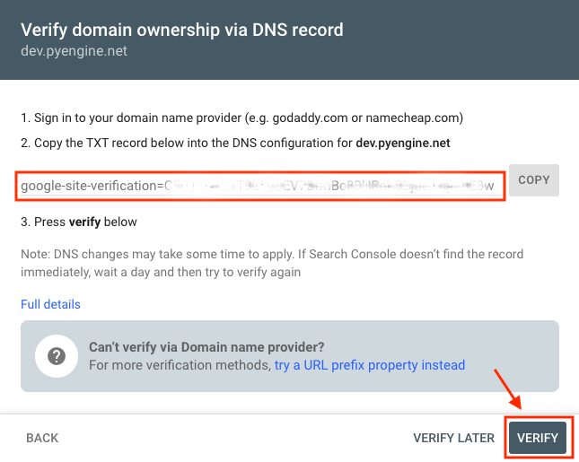
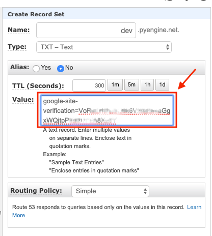

## 전체 프로세스

본 가이드는 Google OAuth 플러그인 연동을 위한 사용자 환경 설정 가이드입니다.

구글 워크스페이스를 사용하는 회사의 경우 클라우드포레의 OAuth 플러그인은 사용자의 로그인 프로세스를 간소화하는데 도움이 됩니다.  
클라우드 포레의 OAuth 플러그인을 연동하려면 다음과 같은 작업이 선행되어야 합니다.

[1. OAuth 클라이언트 ID 생성](./GUIDE.md/#1-oauth-클라이언트-id-생성)  
[2. Domain 검증](./GUIDE.md/#2-domain-검증)

 
 

## 1. OAuth 클라이언트 ID 생성

사용자 회사의 Google 워크스페이스에 접근하려면 OAuth 클라이언트 ID가 필요합니다.  
따라서 연동을 위해 먼저 OAuth 클라이언트 ID를 생성하고 JavaScript Origin과 리다이렉트 URL을 Google 워크스페이스에 추가해야 합니다.

(1) [GCP(Google Cloud Platform)](https://cloud.google.com/) 콘솔에 로그인 후 [탐색 메뉴]에서 [API 및 서비스]를 선택합니다.    
&nbsp;&nbsp;&nbsp;&nbsp;&nbsp;[사용자 인증 정보] 탭에서 OAuth 클라이언트 ID 생성을 위해 [사용자 인증 정보 만들기] >  버튼을 클릭 합니다.

만약, OAuth 클라이언트 ID 생성 전 [동의 화면 구성]을 선행하지 않았다면 진행해야 합니다.  
[동의 화면 구성]은 Google 로그인 시 사용자 동의 화면을 커스터마이징 할 수 있는 것을 의미합니다.  
현재, GCP에서 충분한 가이드를 제공하고 있으므로 현재 문서인 클라우드포레에서의 Google Oauth 플러그인 연동 가이드에서는 생략 하겠습니다.

(2) [애플리케이션 유형]은 `웹 애플리케이션` 을 선택 하고 [이름]을 작성 합니다.  
&nbsp;&nbsp;&nbsp;&nbsp;&nbsp;[승인된 자바스크립트 원본]에 맞는 URL을 작성 합니다.  
&nbsp;&nbsp;&nbsp;&nbsp;&nbsp;[승인된 자바스크립트 원본]은 웹 애플리케이션을 호스팅하는 HTTP 원본입니다.  
&nbsp;&nbsp;&nbsp;&nbsp;&nbsp;[승인된 리디렉션 URI]를 작성 합니다.  
&nbsp;&nbsp;&nbsp;&nbsp;&nbsp;이제, [만들기] 버튼을 클릭해 생성합니다.

(3) OAuth 클라이언트 생성 직후 모달을 통해 [클라이언트 ID], [클라이언트 보안 비밀번호]를 획득할 수 있습니다.  
&nbsp;&nbsp;&nbsp;&nbsp;&nbsp;추후 설정에 사용됨에 따라 [JSON 다운로드]를 권장합니다.

이제 OAuth 클라이언트 ID 생성이 완료되었으니 Domain 검증을 진행합니다.

 
 

## 2. Domain 검증

새로운 OAuth 클라이언트 ID를 발급 받았을 경우
상위 도메인이 Google에 인증되어 있지 않아, 하위 도메인 추가 전에 상위 도메인을 Google로부터 인증 받아야 합니다.

(1) [도메인 확인] 탭을 클릭 한다.  
&nbsp;&nbsp;&nbsp;&nbsp;&nbsp;그림에서 볼 수 있듯이, 현재 [Google Search Console]에서 도메인 확인 작업을 진행할 수 있다.

(2) [Google Search Console]에서 [Add property] 버튼을 클릭합니다.

(3) 띄어진 모달에서 좌측 [Domain]에서 상위 도메인을 기입 후 [Continue] 버튼을 클릭 합니다.

(4) ”`google-site-verification`”라고 적힌 텍스트를 복사한다.  
&nbsp;&nbsp;&nbsp;&nbsp;&nbsp;복사한 텍스트는 Route53에서 TXT Record를 아래와 같이 생성합니다.  
&nbsp;&nbsp;&nbsp;&nbsp;&nbsp;기존에 생성된 TXT Record가 있을 경우 위의 Text로 변경해도 무방합니다.  
&nbsp;&nbsp;&nbsp;&nbsp;&nbsp;이후, [VERIFY] 버튼을 클릭 합니다.

(5) [VERIFY] 진행 후 실패가 뜰 수 있습니다.  
&nbsp;&nbsp;&nbsp;&nbsp;&nbsp;Route53에 Record를 추가하는데 시간이 필요할 수 있으니 몇분 기다렸다가 다시 [VERIFY] 버튼을 클릭합니다.  
&nbsp;&nbsp;&nbsp;&nbsp;&nbsp;최종적으로 Domain 확인이 완료됩니다.

 
 

## 이후 진행 사항

위 진행사항을 통해 ****OAuth 클라이언트 ID 생성하고 또한 유효한 도메인인지 검증하는 과정을 진행하였습니다.****

이후, [1. OAuth 클라이언트 ID 생성](./GUIDE.md/#1-oauth-클라이언트-id-생성)에서 획득한 [**클라이언트 ID**]와 [**클라이언트 보안 비밀번호**]를   
클라우드포레 관리자에게 전달해주시면 OAuth 연동을 지원 해드리도록 하겠습니다.